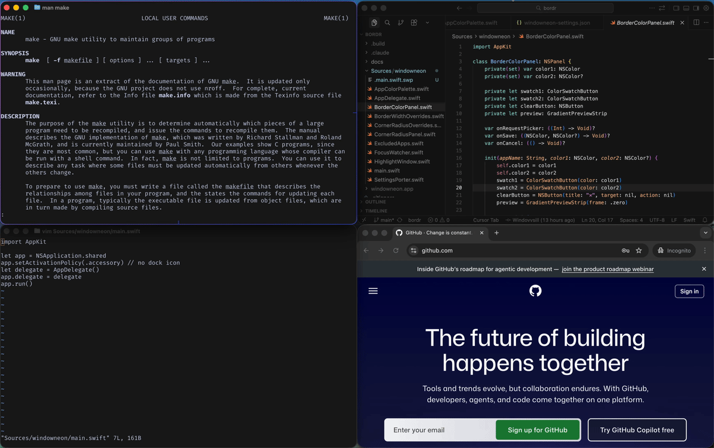

# windowneon

Draws a border around the focused window on macOS.



## Requirements

- macOS 13+
- Xcode command line tools (`xcode-select --install`)

## Run from source

```bash
git clone https://github.com/Windovvsill/windowneon
cd windowneon
swift run
```

## Build a release app

```bash
make app
open windowneon.app
```

Grant Accessibility permission when prompted. The windowneon icon will appear in your menu bar.

## Usage

Windowneon runs silently in the background. Each app automatically gets its own color derived from its bundle ID, so you can tell at a glance which window is focused.

The menu bar icon gives access to all settings:

- **Border Width** — choose from 1–10pt
- **Set Corner Radius for [App]** — set a per-app corner radius with a live preview slider
- **Set Border Color for [App]** — override the auto-assigned color for the current app using the system color picker; the border updates live as you pick
- **Launch at Login** — start windowneon automatically when you log in
