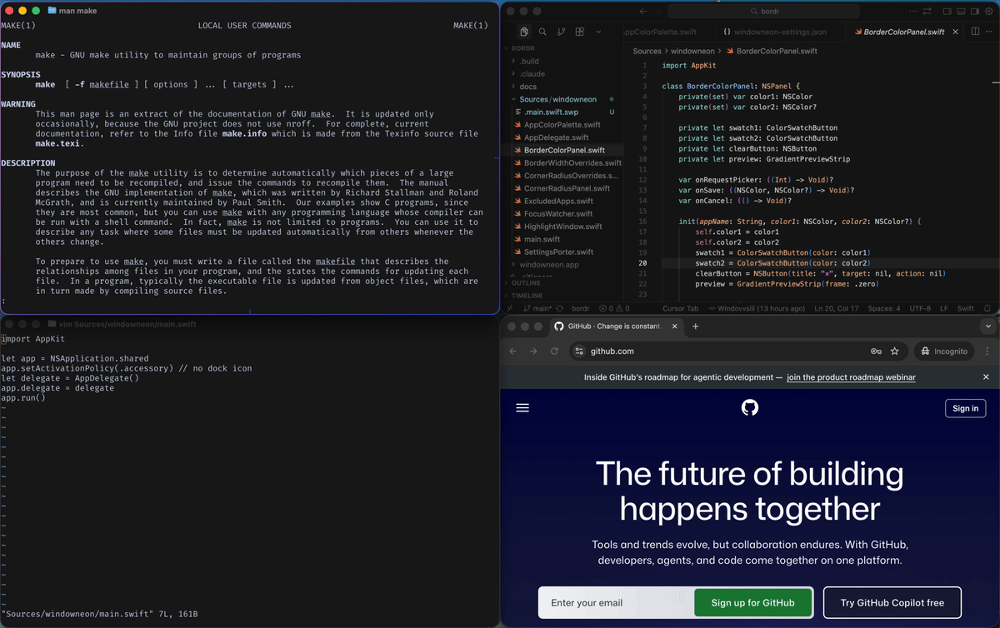

# windowneon

A macOS menu bar app that draws a colored border around the active window, so you always know which window has focus. Useful for split-screen work, multiple monitors, and anyone who finds macOS makes it hard to tell which window is active.



## Install

Download the latest `windowneon-x.x.x.zip` from the [Releases](https://github.com/Windovvsill/windowneon/releases) page, unzip it, and move `windowneon.app` to your Applications folder.

## Accessibility permission

Windowneon requires Accessibility access to detect which window is currently focused. macOS will prompt you on first launch. You can also grant it manually in System Settings under Privacy and Security, then Accessibility.

The app only uses this permission to read window positions and focus state. It does not read window contents, keystrokes, or any other input.

## Requirements

macOS 13 or later.

## Features

The menu bar icon gives access to all settings, which are per-app unless noted:

- **Border width** -- choose a global default from 1-10pt
- **Customize border** -- a per-app style editor with live preview:
  - up to 8 colors blended as a gradient (with opacity)
  - stroke style: solid, dashed, or dotted
  - motion: pulse, spin (the gradient sweeps around the window), or march (marching-ants dashes), with a speed slider
  - glow for a neon halo
  - per-app width and corner radius overrides
- **Exclude app from border** -- hide the border for specific apps
- **Show edge ticks** -- short perpendicular marks at the midpoint of each edge, useful in split-screen to see which side is focused at a glance; ticks are suppressed at screen edges
- **Draw border outside window** -- extend the border outward instead of inward
- **Fade in on focus** -- animate the border on focus change (off by default)
- **Enable borders** -- toggle all borders on/off with Cmd+Opt+B
- **Export / Import settings** -- save and restore all per-app settings as JSON
- **Launch at login** -- start automatically when you log in
- **Check for updates** -- built-in auto-updater via Sparkle

## URL scheme

Windowneon registers the `windowneon://` URL scheme so you can control the border of the focused window from scripts or the terminal.

| URL | Effect |
|-----|--------|
| `windowneon://set?colors=FF0000` | Override the focused window's border to the given hex color |
| `windowneon://set?colors=FF0000,00FF00,0000FF` | Multi-color gradient (up to 8, comma-separated) |
| `windowneon://reset` | Clear the override on the focused window and restore its per-app style |

`set` accepts these parameters:

| Parameter | Values | Effect |
|-----------|--------|--------|
| `colors` | comma-separated hex, `RRGGBB` or `RRGGBBAA` | 1-8 colors; required (or use legacy `color`/`color2`) |
| `stroke` | `solid`, `dashed`, `dotted` | stroke pattern (default `solid`) |
| `motion` | `none`, `pulse`, `spin`, `march` | animation; `march` needs a dashed or dotted stroke |
| `glow` | `true` | neon halo around the border |
| `speed` | `0.25`-`4` | animation speed multiplier (default `1`) |
| `width` | `0.5`-`20` | border width in points for this window |
| `radius` | `0`-`40` | corner radius in points for this window |

For example, dotted rainbow marching ants:

```bash
open "windowneon://set?colors=FF0000,FF9900,FFEE00,00CC44,2255FF,AA44FF&stroke=dotted&motion=march&glow=true&width=5"
```

The legacy `color=`, `color2=`, and `pulse=true` parameters still work. Overrides are in-memory only — they clear when the app quits.

> **Note:** URL scheme handling requires the app to be running as a built `.app` bundle. It does not work when launched via `swift run`. To test, run `make app && open windowneon.app` first.

A common use case is a shell wrapper that turns borders red when you SSH into a production host:

```bash
# ~/.zshrc
function ssh() {
    if [[ "$*" == *prod* ]]; then
        open "windowneon://set?colors=FF0000&motion=pulse&glow=true"
        command ssh "$@"
        open "windowneon://reset"
    else
        command ssh "$@"
    fi
}
```

## Run from source

```bash
git clone https://github.com/Windovvsill/windowneon
cd windowneon
swift run
```

## Build a release app

```bash
make app
open windowneon.app
```
